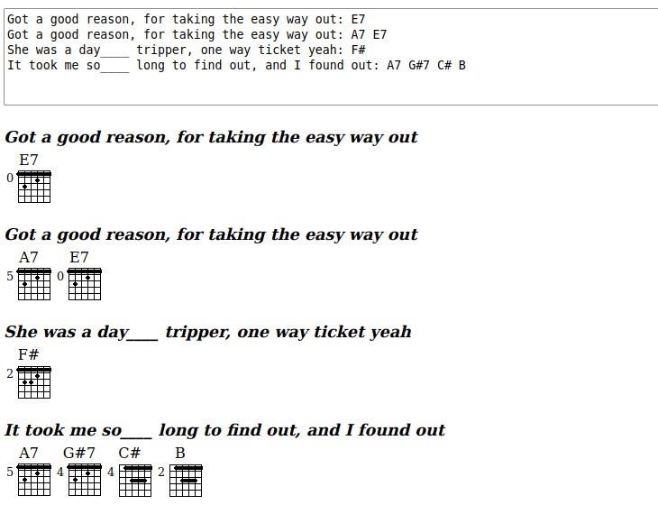

# Guitar Notes

(I apparently made this on Sun 08 May 2011 13∶42∶27)

While going through some old files I found this little application that lets you type guitar 
chords (G, Gdim7, etc) into a text box and generate basic chord diagrams. The idea behind this
was to let me just jot down music ideas. It doesn't do any thing fancy, and is kind of the 
equivalent of just writing chords down on a piece of paper.

This version is so old it uses the browser's database API (which doesn't exist anymore), and it
uses JQuery.

I am just putting this up for posterity, and I may update / fix it in the future.

